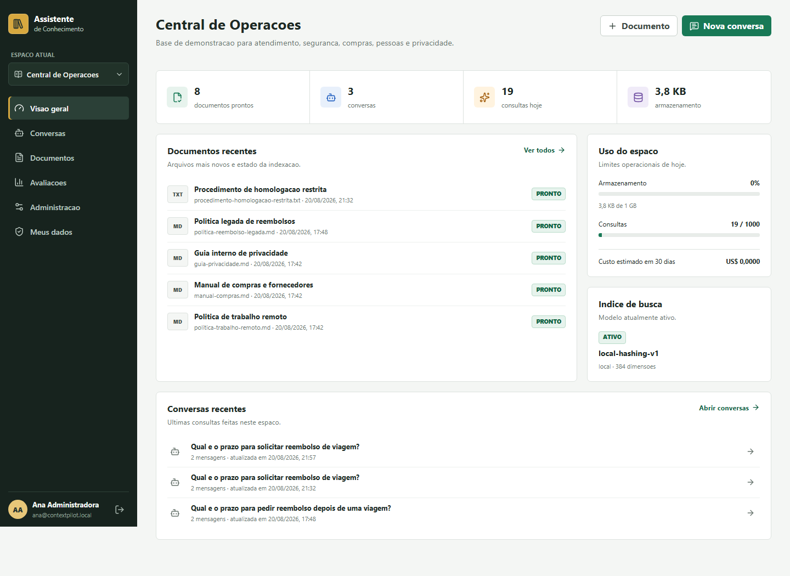
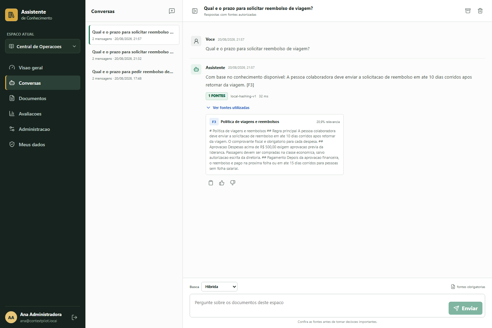
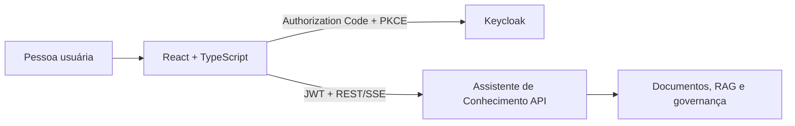

# Assistente de Conhecimento Web

[](https://github.com/Mateusmith/assistente-conhecimento-web/actions/workflows/ci.yml)
[](https://react.dev/)
[](https://www.typescriptlang.org/)
[](https://vite.dev/)
[](LICENSE)

Interface web do [Assistente de Conhecimento](https://github.com/Mateusmith/assistente-conhecimento), uma plataforma privada de busca e perguntas sobre documentos corporativos.

O front-end permite enviar documentos, acompanhar o processamento, conversar com a base autorizada e conferir exatamente quais fontes sustentam cada resposta. Gestores também podem administrar membros, permissões, avaliações, índices de busca e auditoria sem depender de chamadas manuais à API.



## O que o projeto entrega

- login OAuth2/OIDC com Authorization Code + PKCE pelo Keycloak;
- isolamento por espaço e navegação orientada ao contexto selecionado;
- upload, acompanhamento, download, reprocessamento e permissões de documentos;
- chat via Server-Sent Events, histórico, idempotência, fontes expansíveis e feedback;
- avaliações de qualidade e acompanhamento de execuções assíncronas;
- administração de membros, governança, índices de embedding, comparação de busca e auditoria;
- exportação e exclusão de dados pessoais;
- estados de carregamento, vazio e erro, layout responsivo e acessibilidade por teclado;
- testes unitários, integração visual ponta a ponta e build reproduzível em Docker.



## Arquitetura



A aplicação organiza o código por funcionalidade. Páginas cuidam da composição, serviços encapsulam os contratos HTTP, o cliente central trata erros e autenticação, e o TanStack Query controla cache e sincronização com a API. Veja [a documentação de arquitetura](docs/ARCHITECTURE.md).

## Tecnologias

- React 19, TypeScript 6 e Vite 8
- React Router e TanStack Query
- `oidc-client-ts` para OAuth2/OIDC com PKCE
- Zod para validação dos contratos recebidos
- Lucide para ícones
- Vitest, Testing Library e Playwright
- ESLint, Docker, Nginx e GitHub Actions

## Início rápido

### Requisitos

- Node.js 22.12 ou superior
- API e Keycloak do back-end em execução

Primeiro, suba o back-end conforme o [guia oficial](https://github.com/Mateusmith/assistente-conhecimento#inicio-rapido). Depois:

```powershell
cd assistente-conhecimento-web
Copy-Item .env.example .env
npm install
npm run dev
```

Acesse [http://localhost:3000](http://localhost:3000).

Credenciais locais de demonstração:

| Usuário | Senha | Perfil principal |
|---|---|---|
| `ana` | `context123` | proprietária |
| `bruno` | `context123` | curador |
| `carla` | `context123` | leitora |

Essas credenciais existem somente no ambiente local.

### Variáveis de ambiente

| Variável | Padrão local | Finalidade |
|---|---|---|
| `VITE_API_URL` | `http://localhost:8083` | endereço público da API |
| `VITE_OIDC_AUTHORITY` | `http://localhost:18084/realms/contextpilot` | emissor OIDC |
| `VITE_OIDC_CLIENT_ID` | `contextpilot-web` | cliente público com PKCE |
| `VITE_OIDC_SCOPE` | `openid profile email` | escopos solicitados |

As variáveis do Vite são incorporadas durante o build. Não coloque segredos nelas: o cliente é público e não utiliza `client_secret`.

## Docker

Com o back-end em execução:

```powershell
docker compose up -d --build
```

O Nginx publica a aplicação em [http://localhost:3000](http://localhost:3000), aplica fallback para rotas da SPA e adiciona cabeçalhos básicos de segurança.

## Qualidade

```powershell
npm run check
npm run test:e2e
```

`npm run check` executa lint, testes unitários e build de produção. O fluxo Playwright sobe o front-end, usa o ambiente real do back-end e comprova login, criação de espaço, upload, processamento, conversa via SSE, fontes e navegação administrativa em desktop e mobile.

## Estrutura

```text
src/
  app/          composição, rotas e provedores
  auth/         sessão OIDC e proteção de rotas
  components/   componentes compartilhados
  features/     funcionalidades de negócio
  lib/          cliente HTTP e utilitários
  services/     contratos da API
  types/        tipos compartilhados
e2e/            jornadas reais com Playwright
docs/           arquitetura e evidências visuais
```

## Segurança

Tokens ficam apenas na sessão do navegador, rotas privadas exigem autenticação e a autorização final permanece no back-end. Consulte [SECURITY.md](SECURITY.md) para relatar vulnerabilidades.

## Licença

Distribuído sob a licença [MIT](LICENSE).
